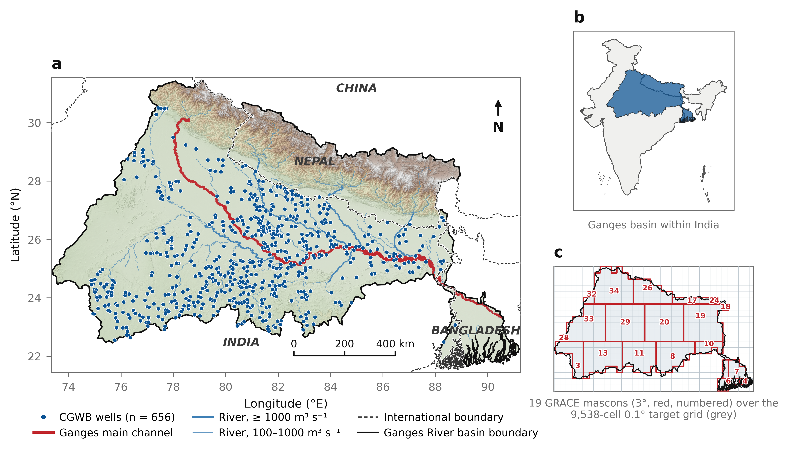
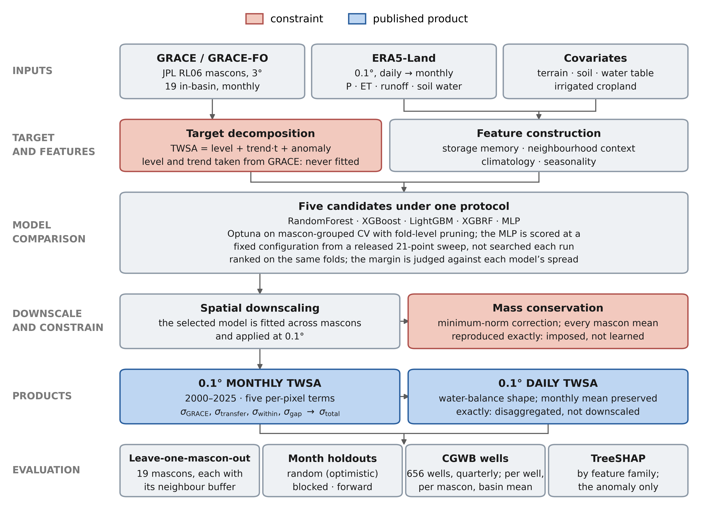

# Explainable AI-Based Spatial Downscaling and Water Balance-Guided Temporal Disaggregation of GRACE Terrestrial Water Storage over the Ganges River Basin

> **On "Ganga" and "Ganges".** They are the same river. The manuscript title, the
> figure plates and the abstract use **Ganges**, the exonym the journal's
> readership will search for; body text and code use **Ganga**, the official
> name used by the Central Water Commission and by CGWB, whose wells are the
> validation set here. The Zenodo record glosses both. The mix is deliberate, and
> three occurrences must never be "corrected": the `Ganga Basin Shapefile/`
> path, the `rivname == 'Ganga'` value in the Government of India river network
> that draws the main channel in Figure 1, and the published Earth Engine asset
> id `ganga_basin`. Renaming any of those breaks something silently.

### 🌍 [Explore the product in your browser](https://grace-grb-ml.projects.earthengine.app/view/twsa-explorer)

No download, no Earth Engine account. Monthly and seasonal means, per-pixel
time series with their ±1σ band, which months GRACE actually measured, and
the significance-masked trend. Source in [`gee/`](gee/).

## Citation

### The paper

Kaushik, P. R., Majumdar, S., Lenczuk, A., Sharma, Y. K., Banerjee, S., & Thakur, P. K. (2026). Explainable AI-Based Spatial Downscaling and Water Balance-Guided Temporal Disaggregation of GRACE Terrestrial Water Storage over the Ganges River Basin. _Under review in Groundwater for Sustainable Development._

### The data and code

Kaushik, P. R., Majumdar, S., Lenczuk, A., Sharma, Y. K., Banerjee, S., &
Thakur, P. K. (2026). _Downscaled GRACE terrestrial water storage anomalies
for the Ganga (Ganges) River Basin at 0.1°: Monthly and daily fields with
per-pixel uncertainty, 2000–2025_ [Data set]. Zenodo.
https://doi.org/10.5281/zenodo.21745159

> **That is the VERSION DOI for v1.0.0**, which is what a paper should cite: it
> pins the exact artefact rather than whatever was released last. **All
> versions:** https://doi.org/10.5281/zenodo.21745158 — the concept DOI, which
> always resolves to the most recent release. Code and data ship as **one
> record**: it is marked CC-BY-4.0, which covers the data, while the bundled
> source code remains GPL-3.0-only under its own `LICENSE`.


## Executive Summary


A **0.1° (~11 km) monthly and daily terrestrial water storage anomaly product**
for the Ganga basin, 2000–2025, with per-pixel uncertainty. GRACE and GRACE-FO
JPL RL06 mascons are spatially downscaled by fitting a predictor–TWSA relation
across mascons; every mascon's area-weighted aggregate is then forced back onto
the observed value. The monthly field is disaggregated to daily under an exact
monthly constraint, its within-month shape supplied by the ERA5-Land water
balance with nothing fitted at the daily scale.

**19 GRACE mascons constrain 9,538 cells**, so fine spatial structure is
*inferred*, not observed, and mascon-scale agreement is imposed by mass
conservation rather than earned. Skill is therefore reported only where it can be
measured: RMSE 88 mm leave-one-mascon-out, 91 mm for out-of-record months, and
r = 0.814 against 656 independent CGWB wells at basin scale, against a bilinear
baseline at r = 0.742. 27% of months carry no GRACE observation and are
reconstructions, flagged per time step by `grace_observed`.

[METHODS.md](METHODS.md) is the method of record. [CHANGELOG.md](CHANGELOG.md)
records what this replaced and why, including the superseded abstract of the
original basin-scale manuscript.

## The study area and the method



**The basin, and the problem.** 656 CGWB monitoring wells over the Ganga basin,
with the river network and terrain. Panel (c) is the constraint the whole project
works against: GRACE resolves **19 mascons** over this basin, and the product asks
for **9,538 cells** at 0.1°. Fine structure is therefore *inferred* from
ERA5-Land, never observed, and agreement with GRACE at mascon scale is imposed by
construction rather than earned. India is drawn from a Survey of India consistent
outline.



**What is fitted and what is not.** Level and trend are taken from GRACE per
mascon and never fitted — the basin's secular decline is groundwater abstraction,
and no reanalysis simulates pumping — so only the anomaly is learned. Mass
conservation is imposed rather than learned. The daily field is *disaggregated*
under an exact monthly constraint, with nothing fitted at the daily scale. Both
figures are regenerated by [`figures/`](figures/).

## Project Structure

```
grace-grb/
├── README.md                           # This file
├── LICENSE
├── environment.yml                     # PINNED environment — the versions every result was produced under
├── Data/
│   ├── README.md
│   ├── All_Data.csv                    # Daily predictors, generated by build_all_data.py
│   ├── TWS_GRACE_GEE.csv               # GRACE target, generated by export_basin_grace.py
│   ├── Ganga Basin Shapefile/          # Basin boundary
│   ├── Groundwater/                    # CGWB wells (Kuruva et al. 2025) - validation only
│   ├── Gridded/                        # Generated: native-grid GeoTIFFs + netCDF cubes (~10 GB, gitignored)
│   │   ├── raw/                        #   one GeoTIFF per (grid, variable, month)
│   │   ├── cubes/                      #   era5/gldas/grace cubes + grids_aux.nc
│   │   └── wells/                      #   ingested well metadata and GWS anomalies
│   └── Outputs/                        # Processed basin-mean CSVs
├── Results/
│   ├── README.md
│   ├── downscaling/                    # THE PRODUCTS: 0.1 deg monthly + daily, and all
│   │                                   #   gridded evidence (spatial CV, month holdouts,
│   │                                   #   gap recovery, well validation)
│   ├── tuning/                         # Optuna outputs (gridded, and legacy basin-scale)
│   └── figures/                        # Fig_shap_families_*, Fig_mlp_configuration_sweep
│       ├── gridded_maps/               # Per-pixel 0.1 deg maps
│       └── temporal_holdout/, random_holdout/, comparison/, leakage_diagnostic/
│                                       #   LEGACY basin-scale; written only under --with-legacy,
│                                       #   so a tree without them is the normal outcome
├── main/
│   ├── README.md                       # Detailed methods and API reference
│   ├── run_full_pipeline.sh               # SINGLE ENTRY POINT - regenerates everything
│   │
│   │   # --- shared ---
│   ├── utils.py                        # Data loading, GRACE reader, metrics, SHAP, plotting
│   ├── models.py                       # ML model wrappers (LSTM, BiLSTM, XGBoost, ...)
│   ├── stats_utils.py                  # Bootstrap CIs, significance tests, leakage-aware CV
│   ├── plot_style.py                   # Central figure styling (600 DPI, clean labels)
│   ├── figure_captions.py              # Caption text, kept out of the plates rather than burned in
│   │
│   │   # --- basin-scale (temporal downscaling) ---
│   ├── run_analysis.py                 # LEGACY basin-scale holdouts (--with-legacy)
│   ├── holdout_random.py               # Random holdout
│   ├── holdout_temporal.py             # Temporal (chronological) holdout
│   ├── holdout_spatial.py              # RETIRED - synthetic, leaked by construction
│   ├── analyze_results.py              # Post-hoc CIs, model comparison, leakage diagnostic
│   ├── temporal_closure_validation.py  # LEGACY daily -> monthly closure test
│   ├── tune_hyperparameters.py         # LEGACY basin-scale Optuna tuning
│   ├── generate_monthly_maps.py        # RETIRED - superseded by generate_gridded_maps.py
│   ├── gee_download.py                 # Basin-mean predictor download from GEE
│   │
│   │   # --- gridded (spatial downscaling to 0.1 deg) -- THE METHOD ---
│   ├── gridded_config.py               # Grids, dataset specs, unit provenance, ACTIVE_COVARIATES
│   ├── gee_gridded_download.py         # Native-grid GeoTIFF export from GEE
│   ├── gee_static_download.py          # Static + annual covariates on the 0.1 deg grid
│   ├── build_cube.py                   # netCDF cubes, basin mask, mascon partition
│   ├── export_basin_grace.py           # GRACE target from the gridded cube  <- run first
│   ├── build_all_data.py               # rebuild All_Data.csv from the GEE download
│   ├── downscale_grid_ops.py           # Exact area-overlap regridding operators
│   ├── downscale_features.py           # Gridded feature construction
│   ├── tune_gridded.py                 # Optuna for tree candidates + CV selection of the product model
│   ├── mlp_configuration_sweep.py      # ONE-OFF: fixes the MLP's configuration, releases the sweep
│   ├── downscale_model.py              # Spatial CV + 0.1 deg monthly product + mass conservation
│   ├── downscale_shap.py               # TreeSHAP on the fitted model, grouped by feature family
│   ├── downscale_uncertainty.py        # Per-pixel uncertainty ensemble
│   ├── downscale_daily.py              # DAILY product (water-balance disaggregation)
│   ├── downscale_holdouts.py           # Month holdouts: random / blocked / forward
│   ├── downscale_ablation.py           # Does the design matrix earn its size?
│   ├── downscale_annual_cycle.py       # Annual cycle scored out-of-fold, where scoring is possible
│   ├── downscale_covariate_gate.py     # Standalone covariate diagnostic (no longer selects)
│   ├── generate_gridded_maps.py        # Per-pixel maps from the gridded product
│   ├── wells_ingest.py                 # CGWB well ingest (validation set)
│   ├── validate_wells.py               # Independent validation vs wells, in mm
│   ├── validate_wells_scales.py        # Well comparison at three aggregation scales
│   ├── export_cogs.py                  # COGs + geeup upload script
│   └── make_zenodo_bundles.sh          # Assembles the Zenodo deposit: zips + the loose netCDFs
├── figures/                            # Manuscript figures: scripts AND rendered output
│   ├── README.md
│   ├── fetch_data.py                   # Re-downloads the basemaps; refuses a non-SOI boundary
│   ├── make_fig1_study_area.py
│   ├── make_fig2_workflow.py
│   ├── make_graphical_abstract.py      # Graphical abstract, 2.5:1 for Elsevier; checks its own layout
│   ├── data/                           # Generated: ~845 MB of basemaps, gitignored
│   └── output/                         # Fig1, Fig2, graphical abstract (PDF + PNG) + FIGURE_CAPTIONS.md
├── gee/                                # Earth Engine explorer app — public, no account needed
│   ├── README.md
│   └── twsa_explorer.js
├── paper/                              # Manuscript, reviewer materials, response letter
│   ├── README.md
│   └── spatial/                        # The LIVE revision materials
├── CITATION.cff                        # Citation metadata for the code record
├── .zenodo.json                        # Zenodo deposit metadata (OVERRIDES CITATION.cff)
├── DATA_README.md                      # README for the separate Zenodo DATA record
├── CHANGELOG.md                        # What this replaced and why; the superseded abstract
└── METHODS.md                          # The scientific method: what is fitted, what is not
```

> **On the GRACE target.** `TWS_GRACE_GEE.csv`, generated by
> `export_basin_grace.py`, is the target everything uses. `--compare` is a no-op:
> it looks for a `TWS_JPL.xlsx` that no longer ships (see
> [CHANGELOG.md](CHANGELOG.md#removed) for why it was removed).

## Gridded (spatial) downscaling

A second pipeline produces a **0.1° (~11 km, ERA5-Land native grid) monthly TWSA product** for the Ganga basin, 2000–2025, with per-pixel uncertainty.

```bash
cd main
./run_full_pipeline.sh --with-download   # everything, from raw inputs
```

Or step by step:

```bash
python gee_gridded_download.py     # native-grid stacks (~5 GB)
python gee_static_download.py      # static covariates (53 rasters)
python build_cube.py               # netCDF cubes + mascon partition + static cube
python export_basin_grace.py       # GRACE target  <- everything depends on this
                                   # (no covariate gate: all nine are used)
python downscale_model.py          # spatial CV + 0.1 deg monthly product
python downscale_shap.py           # TreeSHAP attribution (trees only; explains the ANOMALY)
python downscale_uncertainty.py    # per-pixel uncertainty ensemble
python downscale_daily.py          # DAILY 0.1 deg product
python generate_gridded_maps.py    # figures
python wells_ingest.py             # CGWB wells -> validation set (validate_wells needs it)
python validate_wells.py           # independent well comparison
python export_cogs.py              # COGs + geeup upload script
```

### The daily product

`Results/downscaling/twsa_0p1deg_daily.nc` — daily, 0.1 deg, 2000-2025.

The monthly field is the anchor; within-month variation is added as a shape that
is **de-meaned per pixel per month**, so monthly means are untouched and the
daily field re-aggregates to GRACE exactly. Two independent routes are computed:

| variable | derivation |
|---|---|
| `twsa_flux` | running sum of P - ET - Qs - Qsb within the month |
| `twsa_state` | ERA5-Land soil water layers 1-4 + snow water equivalent |
| `daily_method_spread` | half their absolute difference - the only available uncertainty on the sub-monthly shape |

A daily ML model is **deliberately not used**: GRACE is monthly, so no daily
target exists, and such a model could only be trained on an interpolation of the
monthly product and would learn to reproduce that assumption.

> **Daily variation is inferred, not observed.** GRACE is monthly and the CGWB
> wells are quarterly, so nothing validates the sub-monthly shape directly.

### Covariates

Nine covariates on the 0.1 deg grid, **all used**. Seven are static (water table
depth, AWC, root depth, elevation, sub-grid relief, log upstream area, height
above drainage); two are **annual** — irrigated and rainfed cropland fraction
from C3S, one value per year 2000–2022, held constant after 2022.

There is no selection step. A gate (`downscale_covariate_gate.py`) previously
chose the set on held-out skill and admitted none of the nine; it was removed
because it scored on **seasonal-anomaly** R² while the model fits only the
anomaly and takes level and trend from GRACE — so annual land use, which acts on
the depletion **trend**, was being judged on a component it cannot move. Details
in [METHODS.md](METHODS.md) §5.2. The set is pinned in
`gridded_config.ACTIVE_COVARIATES`; `COVARIATES_OVERRIDE` or the
`GRACE_COVARIATES` env var override it.

Categorical land cover is one-hot masked at its native 309 m *before*
aggregation. Requesting the class field directly at 10 km makes Earth Engine
average class **codes**, returning values absent from the LCCS legend that
nonetheless look like ordinary data.

**What GRACE can and cannot constrain here.** JPL RL06 mascons are **3° native**, served on a 0.5° grid: 364 grid cells over the basin carry only **20 distinct values**. A 0.1° product is therefore a ~450× expansion of spatial degrees of freedom. GRACE supplies the mass constraint; ERA5-Land and GLDAS supply all fine-scale texture. Mass conservation forces every mascon's area-weighted aggregate onto the observed value (residual < 1e-9 mm), so **agreement with GRACE at mascon scale is imposed by construction and is not evidence of skill**.

**Real spatial holdout.** Leave-one-mascon-out with a one-mascon neighbour buffer over the 19 in-basin mascons, (qualitative; see note):

> **Note.** The per-component skill figures previously quoted here were produced by an
> ad-hoc script, not by the pipeline, and mixed two different decompositions (their
> shares summed to 116%). They have been removed pending a `--component` flag in
> `downscale_model.py` that computes them reproducibly. The qualitative finding stands
> and *is* reproducible from `downscale_model.py --skip-product`: the predictors transfer
> the seasonal cycle across space well and cannot predict the secular trend, because the
> basin's decline is groundwater abstraction and no reanalysis simulates pumping.


The predictors transfer the monsoon cycle across space well and cannot predict the trend, because the basin's secular decline is groundwater abstraction, which no reanalysis simulates. The product therefore takes level and trend from GRACE and uses the model only for seasonal/spatial structure.

> Spatial skill is measured by leave-one-mascon-out cross-validation. The earlier
> synthetic spatial holdout is retired — it leaked by construction; see
> [CHANGELOG.md](CHANGELOG.md#retired).


### The product is gap-filled

GRACE observes 227 of the 312 months in the record; the rest — most importantly the
~11-month **GRACE → GRACE-FO transition** — have no observation. The 0.1° product is a
**single, continuous, gap-filled field**: every month carries a value.

For an unobserved month, mass conservation cannot act, so the value is the extrapolated
per-mascon level+trend plus the modelled seasonal anomaly — a reconstruction, not an
observation-constrained estimate. Three things keep that honest:

- **`grace_observed(time)`** — an `int8` flag in the netCDF, `0` for reconstructed months.
  Mask on it for observation-only use.
- **`sigma_gap`** — an extra uncertainty term, zero where GRACE observed and growing with
  depth into a blackout, so the error bar widens where the field is least constrained.
- **It is measured, not asserted.** `gap_recovery_error()` hides contiguous 11-month blocks
  of *observed* months, refits without them, and compares the reconstruction against the
  withheld truth. Results in `Results/downscaling/gap_recovery_rmse_by_depth.csv`.

This matters because leave-one-mascon-out validates transfer across **space**, not across a
temporal blackout — it cannot speak to gap-fill skill, and the gap test exists to fill that
hole. Note also that the extrapolated component is the **trend**, which is exactly what the
predictors cannot reproduce (R² ≈ 0.11 at unseen mascons); reconstruction quality therefore
depends on the trend staying linear across the gap.

> The basin-scale half behaves differently by design: it *drops* days spanning gaps longer
> than one missing month rather than reconstructing them, because its target there would be
> a 334-day straight-line interpolation anchored by nothing.

**Independent validation** uses 656 quality-controlled CGWB dug wells inside the basin (Kuruva et al., *Sci Data* 12, 1609, 2025; [figshare](https://doi.org/10.6084/m9.figshare.29293877)), converted to groundwater storage anomalies via ΔGWS = −S<sub>y</sub>·Δh on the GRACE 2004–2010 baseline. Wells are quarterly, so they validate spatial pattern and seasonal amplitude, never daily structure.

## Final products

Everything below is written by `main/run_full_pipeline.sh` into
`Results/downscaling/`. All three data products share one grid: **0.1°**,
lat **21.5–31.5 °N** (101), lon **73.4–91.2 °E** (179), **9,538 in-basin cells**
of 18,079; anomalies in **mm** on the JPL RL06 **2004.0–2010.0** baseline;
`NaN` outside the basin. Each file carries its own caveats as netCDF global
attributes — read them before use.

### The three data products

| file | grid | time | variables | size |
|---|---|---|---|---|
| **`twsa_0p1deg_monthly_with_uncertainty.nc`**<br>*the product to use* | 312 × 101 × 179 | monthly, 2000-01 → 2025-12 | `twsa` (ensemble mean), `sigma_total`, `sigma_grace`, `sigma_transfer`, `sigma_within`, `sigma_gap`, `grace_observed` | 31 MB |
| **`twsa_0p1deg_daily.nc`** | 9497 × 101 × 179 | daily, 2000-01-01 → 2025-12-31 | `twsa_flux` (primary), `twsa_state`, `daily_method_spread`, `grace_observed` | 801 MB |
| `twsa_0p1deg_monthly_xgboost.nc` | 312 × 101 × 179 | monthly, 2000-01 → 2025-12 | `twsa`, `grace_observed` | 9.9 MB |

The single-model monthly file is the intermediate `downscale_model.py` writes,
named for whichever model selection picked — `twsa_0p1deg_monthly_<model>.nc`,
and likewise every `*_<model>.csv` and `*_<model>.json` below. `xgboost` appears
throughout only because it is the fallback `run_full_pipeline.sh` uses when
`Results/tuning/selected_model.txt` is absent;
the uncertainty file supersedes it (four-member ensemble: RandomForest, XGBoost,
LightGBM and XGBoost's random-forest mode,
plus the five error terms) and is what should be cited or distributed.

### Three things to read off before using any of them

- **27.2% of the record is reconstruction, not observation.** 227 of 312 months
  are GRACE-observed; the other 85 have no mass constraint (daily: 2,586 of 9,497
  days). `grace_observed` is `0` there. Mask on it for observation-only use, and
  expect `sigma_gap` to dominate the error budget in those months.
- **Fine structure is inferred.** 19 independent mascons support 9,538 cells, so
  agreement with GRACE at mascon scale is imposed by mass conservation and is
  **not** evidence of skill. The evidence is `lomo_cv_xgboost.csv` and
  `well_validation_summary.csv`.
- **Daily variation is not observed at all.** GRACE is monthly and the wells are
  quarterly, so nothing validates the sub-monthly shape directly; the two routes
  agree to `daily_method_spread`, and both re-aggregate to the monthly field
  exactly (closure ≤ 0.0005 mm for `twsa_flux`, ≤ 0.0055 mm for `twsa_state`).
  `sigma_within` is likewise a **lower bound**, not a calibrated error.

### The evidence behind them

These are the files that decide whether the product is trustworthy; they are
outputs in their own right, not scratch.

| file | rows | what it answers |
|---|---|---|
| `well_validation_summary.csv` | 2 | downscaled vs bilinear against 656 wells — **the only non-circular test** |
| `well_validation_by_scale.csv` | 3+ | the same wells scored per-well, per-mascon and basin-wide — the scale at which the comparison is made changes the verdict |
| `lomo_cv_xgboost.csv` | 19 | leave-one-mascon-out skill, one row per mascon: does it transfer across **space** |
| `holdouts_month_xgboost.csv` | 3 | month holdouts — `random` / `blocked` / `forward`: does it transfer across **time** |
| `gap_recovery_rmse_by_depth.csv` | 32 | reconstruction error vs months into a blackout, by regime (interior / forward / backward) |
| `feature_ablation_xgboost.csv` | 5 | does the design matrix earn its size? Configurations scored on the tuner's own grouped CV, with repeats |
| `covariate_gate_xgboost.csv` | 10 | each covariate's individual held-out skill (retired gate; not regenerated) |
| `covariate_gate_joint_sets_xgboost.csv` | 4 | covariate skill in combination — the record behind using all nine. **Produced by a one-off analysis, not by any script in the repo**; retained as evidence, not reproducible from `downscale_covariate_gate.py`, which scores one covariate at a time |
| `transfer_rmse_by_mascon_season.csv` | 684 | spatial-transfer error by mascon × calendar month (feeds `sigma_transfer`) |
| `temporal_holdout_xgboost.csv` | 11 | forward-block error vs months beyond the training record |
| `well_validation_matches.csv` | one row per matched well-month | the per-observation matches behind the summary |
| `summary_xgboost.json` | — | pooled CV metrics, conservation residuals, per-month `grace_observed` |

> **The well comparison is scale-dependent, and that is the result.** Measured
> on the current 78-feature build against the same 656 wells and 40,345
> well-months, the downscaled field beats bilinear interpolation **at basin
> scale** (r 0.814 vs 0.742; RMSE 57.0 vs 73.1 mm), is **mixed at mascon scale**
> (better correlation in 6 of 10 mascons, better RMSE in 5; median r 0.695 vs
> 0.616 but median RMSE 111.6 vs 110.8 mm), and **loses at the point scale**
> (median well r 0.430 vs 0.484; RMSE 253.1 vs 242.2 mm; better correlation at
> 273 of 656 wells and better RMSE at only 182).
>
> Admitting the nine covariates — including irrigated cropland, the field most
> plausibly relevant to a well comparison — did **not** reverse the point-scale
> verdict; it narrowed it. That is the expected shape for a 0.1° cell derived
> from a 3° mascon compared against a point head times an estimated specific
> yield: neither side is ground truth, and the disagreement grows as the
> comparison scale shrinks. It is reported as the finding rather than collapsed
> into one pooled number. All three levels are in
> `well_validation_by_scale.csv`.

## Running the project

### 1. Download and install Anaconda/Miniconda
Either [Anaconda](https://www.anaconda.com/products/individual) or [miniconda](https://docs.conda.io/en/latest/miniconda.html) is required for installing the Python 3 packages. 
It is recommended to install the latest version of Anaconda or miniconda (Python >= 3.10). If Anaconda or miniconda is already installed, skip this step. 

**For Windows users:** Once installed, open the Anaconda terminal (called Ananconda Prompt), and run ```conda init powershell``` to add ```conda``` to Windows PowerShell path.

**For Linux/Mac users:** Make sure ```conda``` is added to path. Typically, conda is automatically added to path after installation. It may be necessary to restart the current shell session to add conda to path.

The conda package manager can be updated by running the following command: ```conda update conda```

Anaconda is a Python distribution and environment manager. Miniconda is a free minimal installer for conda. These will help in installing the correct packages and Python version to run the codes.

### 2. Clone or download the repository

Download the repository from the compressed file link at the top right of the repository webpage, or clone the repository using Git.
Unzip all zipped files.  Several of the input datasets in this repository are zipped for efficient storage and must be unzipped before they can be used to run this project.

#### Repository disk space requirements

Two different quantities, kept apart because every `.nc` and `.tif` is
gitignored: what a clone costs, and what a full run generates.

| Component | Size | Description |
|-----------|------|-------------|
| Data/ (tracked) | ~120 MB | Basin shapefile, CGWB wells, predictor CSVs |
| Results/ (tracked) | <1 MB | Small text evidence only |
| main/ | <1 MB | Source code |
| **Total, as cloned** | **~121 MB** | Measured with `git ls-files` |
| Data/Gridded/ (generated) | ~12 GB | Native-grid GeoTIFFs and netCDF cubes |
| Results/downscaling/ (generated) | ~850 MB | 801 MB daily + 31 MB monthly + 9.9 MB single-model |

**Note:** the generated rows depend on how much of the pipeline is run; none of
it is in git.

### 3. Creating the conda environment

Use the **pinned** environment file. Open a Linux/Mac terminal or Windows
PowerShell in the repository root:

```bash
conda env create -f environment.yml
conda activate grace-grb
```

> **Why pinned, and why it matters here.** Gradient-boosting results depend on
> library versions, and this project has been bitten by it: LightGBM 4.6 with
> scikit-learn 1.8 treats an ndarray fitted without feature names differently
> from earlier pairings. An unpinned install reproduces the *code* but not
> necessarily the *numbers*.
>
> `environment.yml` pins the full environment (~25 packages). Each product also
> carries a `provenance` record of the versions that matter to the numbers — a `provenance` block in the
> summary JSON and matching netCDF global attributes — so a data file states its
> own environment even when separated from this repository:
>
> ```bash
> python -c "import json; print(json.load(open('Results/downscaling/summary_xgboost.json'))['provenance'])"
> ncdump -h Results/downscaling/twsa_0p1deg_monthly_xgboost.nc | grep provenance_
> ```

<details>
<summary>Unpinned install (not recommended — will not reproduce the reported numbers exactly)</summary>

```bash
conda create -y -n grace-grb python=3.12
conda activate grace-grb
conda install -y -c conda-forge rioxarray gdal geopandas lightgbm py-xgboost \
    earthengine-api rasterstats seaborn openpyxl pytorch dask-ml dask-jobqueue \
    swifter shap optuna
```
</details>

### 4. Google Earth Engine Authentication
This project relies on the Google Earth Engine (GEE) Python API for downloading (and reducing) some of the predictor datasets from the GEE
data repository. After completing step 3, run ```earthengine authenticate```. The installation and authentication guide 
for the earth-engine Python API is available [here](https://developers.google.com/earth-engine/guides/python_install). The Google Cloud CLI tools
may be required for this GEE authentication step. Refer to the installation docs [here](https://cloud.google.com/sdk/docs/install-sdk).

A GCloud project needs to be set up online (e.g., ```grace-grb-ml```), with the GEE API service enabled (https://console.cloud.google.com/). Then set a default project using ```gcloud config set project grace-grb-ml```. Additionally, you may need to run ```gcloud auth application-default set-quota-project grace-grb-ml``` if prompted by the GCloud CLI. 
After that, run ```earthengine authenticate```. The installation and authentication guide 
for the earth-engine Python API is available [here](https://developers.google.com/earth-engine/guides/python_install). 

### 5. Running the code

See [main/README.md](main/README.md) for detailed documentation on methods and API reference.

#### Everything at once

```bash
cd main

# One-time: download the gridded stacks (~5 GB, ~15 min, hits Earth Engine)
python gee_gridded_download.py
python gee_static_download.py   # covariates; without them build_cube.py writes no
                                # static_cube.nc and the pipeline's preflight FAILS
python build_cube.py

# Then regenerate the product and its validation (the legacy half needs --with-legacy)
bash run_full_pipeline.sh
```

`run_full_pipeline.sh` is the single entry point, logging to
`run_full_pipeline.log`. It has **two step classes**: `require` steps abort the
run on failure, because everything after them would otherwise consume a stale or
absent file; `run` steps log and continue, and are used only for leaf steps whose
failure cannot corrupt anything downstream. An earlier version used `run` for
everything, so a failed first step left every later step reading an absent GRACE
target while still reporting success.

#### Step by step

**Step 0 — the GRACE target. Everything depends on this.**

```bash
python export_basin_grace.py --compare   # -> Data/TWS_GRACE_GEE.csv
```

Derives the basin-mean GRACE series from the same gridded mascon product the 0.1°
pipeline uses, so both halves rest on one source. `--compare` reports agreement
with a legacy `TWS_JPL.xlsx` if one is present; none ships, so it is a no-op.

**Gridded (spatial downscaling to 0.1°) — this is the method**

```bash
python wells_ingest.py                     # CGWB wells -> independent validation set
python tune_gridded.py --all              # tunes the FOUR TREE candidates (15 trials each); the
                                          # MLP is scored at its released fixed configuration rather
                                          # than searched (--search-fixed overrides). All five are
                                          # then ranked and the winner written to
                                          # Results/tuning/selected_model.txt
python tune_gridded.py --select           # re-run the ranking only, from the existing JSON
python mlp_configuration_sweep.py         # ONE-OFF (~1 h): settles the MLP's fixed configuration
python mlp_configuration_sweep.py --plot-only   # redraw the sweep figure from the CSV
python downscale_model.py --model xgboost  # spatial CV + 0.1 deg monthly product
                                          # (run_full_pipeline.sh passes the SELECTED model here)
python downscale_model.py --skip-product   # spatial CV only (fast)
python downscale_uncertainty.py            # per-pixel uncertainty ensemble
python downscale_daily.py                  # DAILY product, disaggregated under an exact monthly constraint

python downscale_holdouts.py --model xgboost  # month holdouts: random / blocked / forward
python generate_gridded_maps.py            # per-pixel climatology, seasonal, trend, uncertainty
python validate_wells.py                   # downscaled vs wells vs interpolation, in mm
python validate_wells_scales.py            # wells at three scales: per-well / mascon / basin
```

Validation covers two axes, deliberately separated. `downscale_model.py` measures
transfer across **space** (leave-one-mascon-out over 19 mascons);
`downscale_holdouts.py` measures transfer across **time** by holding out whole
months, in three schemes — `random`, `blocked`, `forward`. The random one is
reported but labelled optimistic: monthly TWSA is autocorrelated, so a random
split leaves each held-out month's neighbours in training. Read the gap between
`random` and `forward`, and quote `forward`.

**Legacy basin-scale (superseded)**

Retained only so the earlier manuscript's figures can be reproduced. These are
**basin-mean** analyses: one value for the whole basin per time step. They share
no code path with the downscaling above, and nothing in the current method reads
their output.

```bash
./run_full_pipeline.sh --with-legacy    # or the individual scripts:

python tune_hyperparameters.py --models randomforest xgboost lightgbm --trials 50 --splits 4
python tune_hyperparameters.py --models lstm bilstm bilstm_attention --nn-trials 15 --splits 3
python tune_hyperparameters.py --summarize           # tuning_summary.{csv,md,png}
python run_analysis.py --analysis all --compare \
       --tuned-params ../Results/tuning/best_params.json
python analyze_results.py --holdout-dir ../Results/figures/temporal_holdout --n-boot 2000
python analyze_results.py --leakage --models randomforest xgboost lightgbm
python temporal_closure_validation.py --predictions-dir ../Results/figures/temporal_holdout
```

The trial and fold counts are the ones the earlier results came from
(`main/tune_trees.log`, `main/tune_nn.log`), not the script defaults; the trees
were tuned over 4 walk-forward folds and the nets over 3.

> **Not in the list above, and not callable.** `generate_monthly_maps.py` is
> reachable from no pipeline, and `--analysis spatial` exits with an explanation
> rather than running. Both are retired; [CHANGELOG.md](CHANGELOG.md#retired)
> says why, and `downscale_model.py --skip-product` is what replaced the latter.

#### Available models

**Gridded (the method)** — `--model` on `downscale_model.py` and
`downscale_holdouts.py`; `--models`/`--all` on `tune_gridded.py`:

- `xgboost`, `lightgbm` — gradient boosting
- `random_forest`, `xgboost_rf` — bagging (the latter is XGBoost's forest mode)
- `mlp` — a neural model, as imputation → standardisation → MLP. Fixed
  configuration from a released sweep, not a per-run search

The **uncertainty ensemble** is the four tree models; the MLP is for comparison
only. Recurrent and convolutional networks are excluded for structural reasons —
no sequence exists for an LSTM to consume, and no fine-scale observation exists
to train a CNN against. See [METHODS.md](METHODS.md) §6.

**Legacy basin-scale** — `run_analysis.py --models`, only under `--with-legacy`:
`bilstm_attention`, `bilstm`, `lstm`, `xgboost`, `lightgbm`, `random_forest`.


#### Output Files

`Results/figures/` — basin-scale:
- Model predictions (CSV) with train/test splits
- Performance plots (actual vs predicted, residuals), SHAP analysis, model comparison
- Monthly/seasonal TWS summaries (basin-scale: the whole polygon takes one value)
- Bootstrap confidence intervals and Diebold–Mariano significance tables
- Leakage diagnostic (shuffled vs blocked vs purged + embargo cross-validation)
- Temporal closure test (daily predictions re-aggregated to monthly vs observed GRACE)

`Results/downscaling/` — gridded: the three netCDF products, the per-pixel
trend-significance field (`twsa_trend_significance.nc`), and the evidence
files, enumerated with dimensions, variables and caveats under
[Final products](#final-products). That section is the manifest; this list is
deliberately not a second copy of it.

`Results/figures/gridded_maps/` — per-pixel monthly climatology, seasonal means,
trend, uncertainty components, and the downscaling-versus-interpolation comparison.
