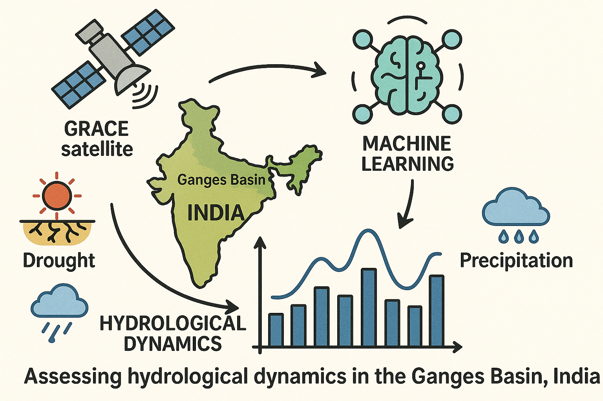

# Explainable AI-Based Temporal Downscaling of GRACE Terrestrial Water Storage in the Ganges River Basin

## Citation
Kaushik, P. R., Majumdar, S., Lenczuk, A., Sharma, Y. K., Banerjee, S., & Thakur, P. K. (2026). Explainable AI-Based Temporal Downscaling of GRACE Terrestrial Water Storage in the Ganges River Basin. _Under review in Groundwater for Sustainable Development._

## Abstract
Terrestrial water storage anomalies (TWSA) are a key indicator of hydrological variability in a basin and are widely used to assess groundwater sustainability and climate-driven changes in the water cycle. GRACE and GRACE-FO satellite gravimetry are an invaluable source of observations of TWSA, but due to their low spatial resolution and monthly time resolution they cannot be directly used to carry out high-resolution hydrological analysis and water resource management, especially in monsoon-controlled basins. This study fills this gap in the temporal downscaling and prediction of TWSA down to a daily resolution and physical interpretability of the Ganges River Basin. We develop an explainable artificial intelligence (XAI) model that combines GRACE-derived TWSA with daily hydroclimatic predictors, including precipitation, evapotranspiration (ET), soil moisture storage (SMS), surface runoff, and groundwater storage anomalies, evaluated with random, temporal, and (synthetic) spatial holdout strategies and interpreted with SHapley Additive exPlanations (SHAP). The ensemble tree-based models (Random Forest and XGBoost) perform best under the random and temporal validation schemes and are statistically indistinguishable from each other, while outperforming the recurrent-network models. Because GRACE observes TWSA only monthly, daily-scale skill is assessed indirectly through a temporal closure test, in which the predicted daily TWSA is re-aggregated to monthly and compared against the original monthly GRACE; this confirms strong temporal self-consistency. SHAP analysis shows that antecedent SMS is the primary predictor of TWSA (about 80% of the total explanatory power), followed by lagged ET (about 10-15%), with relatively minor direct effects of precipitation, providing a mechanistic, storage-memory-based explanation of the reconstructed seasonal cycles. The framework enhances GRACE-based hydrological monitoring by providing interpretable TWSA prediction that can support groundwater assessment and climate-resilient water-resource management in data-sparse regions.



## Project Structure

```
grace-grb/
├── README.md                           # Main readme
├── LICENSE                             # License file
├── Data/                               # Input data files
│   ├── All_Data.xlsx                   # Predictor variables (SMS, ET, rainfall, runoff, GWSA)
│   ├── TWS_JPL.xlsx                    # GRACE TWS data
│   ├── Ganga Basin Shapefile/          # Basin boundary shapefiles
│   ├── Outputs/                        # Processed data outputs
│   └── Readme_Figs/                    # Figures for documentation
├── Results/                            # Analysis results and figures
│   └── figures/                        # Generated plots and maps
│       ├── temporal_holdout/           # Temporal analysis outputs
│       ├── random_holdout/             # Random analysis outputs
│       ├── spatial_holdout/            # Spatial analysis outputs
│       └── monthly_seasonal_maps/      # Monthly/seasonal TWS maps
├── main/                               # Main codebase
│   ├── README.md                       # Detailed methods documentation
│   ├── models.py                       # ML model wrapper classes (LSTM, BiLSTM, XGBoost, etc.)
│   ├── utils.py                        # Utility functions (metrics, plotting, SHAP analysis)
│   ├── holdout_random.py               # Random holdout analysis
│   ├── holdout_temporal.py             # Temporal holdout analysis
│   ├── holdout_spatial.py              # Spatial/grouped holdout analysis (synthetic; see limitations)
│   ├── run_analysis.py                 # Main CLI entry point
│   ├── generate_monthly_maps.py        # Monthly/seasonal TWS map generation
│   ├── gee_download.py                 # Google Earth Engine data download
│   ├── stats_utils.py                  # Bootstrap CIs, significance tests, leakage-aware CV
│   ├── temporal_closure_validation.py  # Daily→monthly temporal closure test
│   ├── analyze_results.py              # Post-hoc CIs, model-comparison significance, leakage diagnostic
│   ├── tune_hyperparameters.py         # Optuna hyperparameter tuning (walk-forward CV)
│   ├── plot_style.py                   # Central figure styling (600 DPI, clean labels)
```

> **Scope note.** This is a **basin-scale (spatially integrated) temporal** downscaling: all inputs are basin-mean series, so results are not per-pixel and the "maps" are basin-scale summaries. The daily target is a linear interpolation of monthly GRACE (no independent daily observation), so daily consistency is assessed via the **temporal closure test** (`temporal_closure_validation.py`). The spatial holdout runs on **synthetic** replicated data and is a noise-sensitivity demonstration only. See [main/README.md](main/README.md#scope-and-limitations-please-read-before-interpreting-results) for details.

## Running the project

### 1. Download and install Anaconda/Miniconda
Either [Anaconda](https://www.anaconda.com/products/individual) or [miniconda](https://docs.conda.io/en/latest/miniconda.html) is required for installing the Python 3 packages. 
It is recommended to install the latest version of Anaconda or miniconda (Python >= 3.10). If Anaconda or miniconda is already installed, skip this step. 

**For Windows users:** Once installed, open the Anaconda terminal (called Ananconda Prompt), and run ```conda init powershell``` to add ```conda``` to Windows PowerShell path.

**For Linux/Mac users:** Make sure ```conda``` is added to path. Typically, conda is automatically added to path after installation. It may be necessary to restart the current shell session to add conda to path.

The conda package manager can be updated by running the following command: ```conda update conda```

Anaconda is a Python distribution and environment manager. Miniconda is a free minimal installer for conda. These will help in installing the correct packages and Python version to run the codes.

### 2. Clone or download the repository

Download the repository from the compressed file link at the top right of the repository webpage, or clone the repository using Git.
Unzip all zipped files.  Several of the input datasets in this repository are zipped for efficient storage and must be unzipped before they can be used to run this project.

#### Repository disk space requirements

| Component | Size | Description |
|-----------|------|-------------|
| Data/ | ~150 MB | Input data (GRACE TWS, ERA5-Land and GLDAS variables, shapefiles) |
| Results/ | ~150 MB | Generated outputs (figures, predictions, maps) |
| main/ | <1 MB | Source code |
| **Total** | **~500 MB** | Full repository with all outputs |

**Note:** The Results folder size will vary depending on how many analyses are run and which models are used.

### 3. Creating the conda environment and installing packages
Open Linux/Mac terminal or Windows PowerShell and run the following:
```
conda create -y -n grace-grb python=3.12
conda activate grace-grb
conda install -y -c conda-forge rioxarray gdal geopandas lightgbm py-xgboost earthengine-api rasterstats seaborn openpyxl pytorch dask-ml dask-jobqueue swifter shap optuna
```

### 4. Google Earth Engine Authentication
This project relies on the Google Earth Engine (GEE) Python API for downloading (and reducing) some of the predictor datasets from the GEE
data repository. After completing step 3, run ```earthengine authenticate```. The installation and authentication guide 
for the earth-engine Python API is available [here](https://developers.google.com/earth-engine/guides/python_install). The Google Cloud CLI tools
may be required for this GEE authentication step. Refer to the installation docs [here](https://cloud.google.com/sdk/docs/install-sdk).

A GCloud project needs to be set up online (e.g., ```grace-grb```), with the GEE API service enabled (https://console.cloud.google.com/). Then set a default project using ```gcloud config set project grace-grb```. Additionally, you may need to run ```gcloud auth application-default set-quota-project grace-grb``` if prompted by the GCloud CLI. 
After that, run ```earthengine authenticate```. The installation and authentication guide 
for the earth-engine Python API is available [here](https://developers.google.com/earth-engine/guides/python_install). 

### 5. Running the code

See [main/README.md](main/README.md) for detailed documentation on methods and API reference.

#### Quick Start

```bash
cd main

# Run all analyses (random, temporal, spatial holdout) with all models
python run_analysis.py --analysis all --compare

# Run specific analysis type
python run_analysis.py --analysis temporal

# Run with specific models only
python run_analysis.py -a random -m bilstm_attention xgboost lightgbm

# Generate monthly/seasonal TWS maps (after running temporal analysis)
python generate_monthly_maps.py
```

#### Available Models
- `bilstm_attention` - BiLSTM with Attention mechanism
- `bilstm` - Bidirectional LSTM
- `lstm` - Standard LSTM
- `xgboost` - XGBoost Regressor
- `lightgbm` - LightGBM Regressor
- `random_forest` - Random Forest Regressor

#### Output Files
Results are saved to `Results/figures/` including:
- Model predictions (CSV) with train/test splits
- Performance plots (actual vs predicted, residuals)
- SHAP analysis plots (feature importance, dependence)
- Model comparison summaries
- Monthly/seasonal TWS maps with statistics (basin-scale)
- Bootstrap confidence intervals and Diebold–Mariano significance tables for every metric
- Leakage diagnostic (shuffled vs blocked vs purged + embargo cross-validation)
- Temporal closure test (daily predictions re-aggregated to monthly vs original monthly GRACE)
