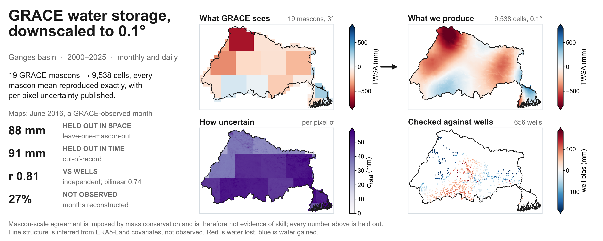

# `main/` — module reference

**Explainable AI-Based Spatial Downscaling and Water Balance-Guided Temporal
Disaggregation of GRACE Terrestrial Water Storage over the Ganges River Basin**



This file documents the **code**. For the scientific method — what is fitted,
what is constrained, what is validated and what is not — see
[METHODS.md](../METHODS.md). For products, installation and how to run anything,
see the [root README](../README.md).

> **On the two halves of this repository.** The project began as a **basin-scale
> temporal** analysis: every input reduced to one basin-mean value per time step,
> six models compared, and the daily field produced by applying a monthly-trained
> model to daily inputs. That was the initial method, and it is superseded. The
> method now is the **0.1° spatial downscaling** with a water-balance daily
> disaggregation, documented here and in METHODS.md.
>
> The earlier code is retained, runs only under
> `./run_full_pipeline.sh --with-legacy`, and is summarised in [Legacy
> basin-scale code](#legacy-basin-scale-code) at the end. Nothing in the current
> method reads its output.

---

## Contents

- [Pipeline order](#pipeline-order)
- [Modules](#modules)
- [Models](#models)
- [Validation](#validation)
- [Uncertainty](#uncertainty)
- [Evaluation metrics](#evaluation-metrics)
- [Reproducibility](#reproducibility)
- [Legacy basin-scale code](#legacy-basin-scale-code)

---

## Pipeline order

`run_full_pipeline.sh` is the single entry point. Two step classes, deliberately
different: `require` aborts the run on failure (anything later steps depend on),
`run` logs and continues (leaf steps whose failure cannot corrupt anything
downstream).

```
inputs        build_all_data.py → export_basin_grace.py → wells_ingest.py
gridded       downscale_ablation.py    (diagnostic; changes nothing)
              mlp_configuration_sweep.py --check-stale   (free; every run)
              tune_gridded.py          (tunes the tree candidates, selects the product model)
              mlp_configuration_sweep.py  (--with-mlp-sweep; AFTER tuning, so its
                                           tree reference is the tuned tree)
              downscale_model.py       → 0.1° MONTHLY product   ← deliverable
              downscale_shap.py        (TreeSHAP, grouped by feature family)
              downscale_uncertainty.py → per-pixel sigma terms
              downscale_daily.py       → DAILY product           ← deliverable
validation    downscale_holdouts.py, generate_gridded_maps.py,
              validate_wells.py, validate_wells_scales.py
legacy        (only with --with-legacy)
```

Flags: `--with-download`, `--check`, `--skip-tuning`, `--skip-ablation`,
`--trials=N`, `--with-legacy`, `--with-mlp-sweep`.

`--with-mlp-sweep` re-derives the MLP's fixed configuration (~1 h). It is
opt-in because re-deriving it every run is the cost that fixing the
configuration exists to avoid. Every run does however check the released
sweep against the current predictor set — free, reads one CSV column — so a
sweep that has gone stale is announced rather than found later in a figure.

---

## Modules

### Data acquisition and preparation

| module | role |
|---|---|
| `gridded_config.py` | grids, dataset specs, unit provenance, `PREDICTORS`, `ACTIVE_COVARIATES` |
| `gee_gridded_download.py` | ERA5-Land / GLDAS / GRACE on their **native** lattices — Earth Engine never resamples on our behalf |
| `gee_static_download.py` | 7 static + 2 annual covariates on the 0.1° grid |
| `gee_download.py` | basin-mean predictor download (feeds the legacy table) |
| `build_cube.py` | netCDF cubes, basin mask, mascon partition, static cube |
| `export_basin_grace.py` | GRACE target from the gridded cube — **everything depends on this** |
| `build_all_data.py` | rebuilds `Data/All_Data.csv` from the GEE download, closing a provenance gap |
| `wells_ingest.py` | CGWB well ingest (Kuruva et al. 2025), the independent validation set |

### The method

| module | role |
|---|---|
| `downscale_grid_ops.py` | exact area-overlap regridding, mascon weights, smoothing |
| `downscale_features.py` | feature construction: antecedents, neighbourhood context, climatology, **API** |
| `downscale_ablation.py` | does the design matrix earn its size? Diagnostic only |
| `tune_gridded.py` | Optuna for every tree candidate, then selects the product model on CV |
| `mlp_configuration_sweep.py` | one-off: settles the MLP's fixed configuration and releases the evidence |
| `downscale_model.py` | spatial CV, 0.1° monthly product, mass conservation, model persistence |
| `downscale_shap.py` | TreeSHAP on the fitted model, grouped by feature family. Trees only — it cannot explain the MLP — and it explains the **anomaly**, never the level or trend |
| `downscale_uncertainty.py` | per-pixel uncertainty ensemble + gap-recovery skill |
| `downscale_daily.py` | daily **disaggregation** (flux and state routes) |

### Validation and output

| module | role |
|---|---|
| `downscale_holdouts.py` | month holdouts: `random` / `blocked` / `forward` |
| `downscale_covariate_gate.py` | standalone covariate diagnostic; **no longer selects** the feature set |
| `generate_gridded_maps.py` | per-pixel climatology, seasonal, trend, RMS, uncertainty, mascon skill |
| `validate_wells.py` | downscaled vs bilinear against the wells, in mm |
| `validate_wells_scales.py` | the same wells at three aggregation scales, plus the residual map |
| `downscale_annual_cycle.py` | annual cycle scored against **out-of-fold** predictions — the basin mean of the product is GRACE's by construction, so scoring the product against GRACE would measure nothing |
| `export_cogs.py` | COGs + `geeup` upload script |
| `make_zenodo_bundles.sh` | assembles the deposit — zips everything except the four product netCDFs, which stay loose. Zenodo caps a record at 100 files and this one holds ~28,000 |

### Shared

| module | role |
|---|---|
| `utils.py` | data loading, GRACE reader, metrics, SHAP, plotting |
| `stats_utils.py` | bootstrap CIs (block **and** cluster), significance tests, and the trend layer: Mann-Kendall with Hamed-Rao variance inflation, Sen's slope, seasonal MK, Benjamini-Hochberg |
| `plot_style.py` | central figure styling — 600 dpi, CVD-safe palette |
| `figure_captions.py` | caption text held in code rather than burned into the plates, so the journal's caption and the figure cannot disagree |
| `models.py` | model wrappers used by the **legacy** basin-scale path |

---

## Models

Five candidates, selectable with `--model` on `downscale_model.py` and
`downscale_holdouts.py` (`tune_gridded.py` takes `--models`/`--all`):

| name | what it is |
|---|---|
| `random_forest` | sklearn RandomForest |
| `xgboost` | gradient boosting |
| `lightgbm` | gradient boosting, leaf-wise |
| `xgboost_rf` | XGBoost's random-forest mode. Bags like RandomForest but with XGBoost's split finding and L2 regularisation. `learning_rate` is **fixed at 1.0** by definition — `make_model` strips any other value — and column sampling is per *node* |
| `mlp` | a neural model, as a pipeline of median imputation → standardisation → MLP. Both steps are required: the design matrix carries 44,040 NaNs across 4,404 rows, and feature standard deviations span ~15 orders of magnitude. **Fixed configuration** — see below |

**Why an MLP and not an LSTM or CNN** — see [METHODS.md](../METHODS.md) §6.
Briefly: temporal memory lives in the *features*, so no sequence exists for a
recurrent network to consume; and a CNN cannot be trained here because no
fine-scale observation of TWSA exists to supply the coarse→fine pairs that
super-resolution needs.

`make_model(name, seed=20, params=None)` reads tuned hyperparameters from
`Results/tuning/gridded_best_params.json`, falling back to documented defaults
when absent — so the pipeline runs without a tuning step, and which set was used
is printed rather than silent.

### Which model builds the product

Not a hardcoded choice. `tune_gridded.py --all` tunes the four tree models,
scores the fixed-configuration MLP on the same folds, ranks all five on that
mascon-grouped CV, and writes the winner to
`Results/tuning/selected_model.txt`; `run_full_pipeline.sh` reads that file and
passes it to `downscale_model.py`, `downscale_holdouts.py` and
`generate_gridded_maps.py`. With no selection file — a fresh checkout, or
`--skip-tuning` — it falls back to `xgboost` and says so.

Each model is ranked on its **adopted** configuration: tuned where tuning beat
the hand-set defaults on those folds, defaults where it did not, so no model is
credited with a search that made it worse.

Tuning all five is not only about picking a winner. The uncertainty ensemble is
four of these models, and `sigma_within` is meant to measure disagreement between
model *families*; tuning one member and leaving three on hand-set defaults would
fold a tuned-vs-untuned artefact into that term. Ensemble members read the same
JSON through `make_model`, so tuning them all makes the comparison symmetric.

### The MLP is fixed, not searched

The four tree models are tuned on every run. The MLP is scored and ranked with
them but its configuration is fixed, set once by `mlp_configuration_sweep.py`
and released as `Results/tuning/mlp_configuration_sweep.csv` plus
`Results/figures/Fig_mlp_configuration_sweep.png`.

That is a stronger disclosure than a per-run search, not a weaker one. The
neural model loses, and the standing objection to such a result is that the
network was never configured fairly; fifteen TPE trials would show a reader the
winner and nothing else, while the sweep shows the whole response surface.

Over 21 configurations it establishes that **width is flat** (so the small
adopted network is the MLP's best case rather than a handicap) while **depth
hurts** (which is why the old two-layer default was dropped), that the
learning-rate optimum is *interior* to the swept range rather than sitting on a
boundary, and that `alpha` is irrelevant across four orders of magnitude. The
best MLP still trails XGBoost.

The numeric values are omitted here on purpose: the sweep was run on an
80-feature matrix, before `runoff_anom`'s two degenerate climatology columns
stopped being built — nothing was dropped from the predictor list — and must be
re-run on the current 78-feature build. The CSV now
records `n_features` and the predictor list on every row so a sweep can always
be matched to the design matrix it measured.

Width and depth are reported separately because one "capacity" number averages a
flat axis with a steep one and is true of neither.

Re-searching it every run would cost ~16x a single scored fit and cannot close
a gap several times larger than any tuning gain measured here. `--search-fixed`
overrides if you want the search anyway.

**The sweep runs after tuning.** Its tree reference uses each tree's *adopted*
configuration, read from the tuning JSON, so the comparison is the MLP's best of
21 configurations against the trees at theirs. Run before tuning it falls back to
hand-set tree defaults — a valid comparison but a weaker one, which would flatter
the network on a technicality; the CSV records which of the two happened. The
cheap `--check-stale` still runs early, because a sweep measured on a different
predictor set is worth knowing about before an hour of tuning rather than after.

**Cost.** Tuning is the expensive step, and three things bound it.

An unpruned search is `models x trials x folds` refits plus one baseline pass per
model — 80 fits per model at the default 15 trials and 5 folds. **Fold-level
pruning cuts that**: a trial that is clearly losing is abandoned after three
folds rather than five, so the real count is lower and varies by how quickly the
search finds a good region. The number of pruned trials is printed per model.

**The MLP no longer contributes to this at all.** It is scored once at its fixed
configuration — 5 fits, not 80 — which is most of the reason the whole step got
cheaper. It used to dominate, at ~100 s per fit against tens of seconds for the
tree models.

Search ranges were also narrowed using where the optima actually landed on the
first full run: every `n_estimators` ceiling came down (lightgbm 1600 → 600,
xgboost 1200 → 700, xgboost_rf 800 → 400), and `xgboost_rf`'s `max_depth` ceiling
20 → 14 because cost there goes as `n_estimators x 2^depth` and that model alone
ran over an hour. Two ranges were *widened* rather than narrowed, because their
optima sat on a boundary: xgboost's `max_depth` and lightgbm's `num_leaves`.
Cutting a dimension whose optimum is on the edge would be cutting toward the
answer instead of away from waste.

`--trials=N` lowers the budget further; `--skip-tuning` reuses whatever is in
the JSON.

Two caveats, both printed at selection time:

- The ranking uses the same CV the tuning optimised, so the winner's absolute
  score is optimistic. The **ranking** is the usable output; absolute skill comes
  from the independent leave-one-mascon-out run, which selection never touches.
- The spread across models is usually small, and it is judged against a
  **measured** yardstick rather than a threshold picked in advance: each model's
  own fold-to-fold standard deviation on the same folds. If the candidates differ
  by less than a single model differs from itself across folds, the selector says
  the ranking is not resolvable. The old fixed 2% rule survives only as a
  fallback for tuning files written before `fold_sd` was recorded.

---

## Validation

Two axes, measured separately because they are different claims.

**Spatial** — `downscale_model.leave_one_mascon_out`. Folds are real 3° mascons,
and each fold *also* removes its spatial neighbours, because JPL's CRI filtering
correlates adjacent mascons and a neighbour left in training is a partial answer
key. With 19 in-basin mascons a fold trains on roughly 12–13.

**Temporal** — `downscale_holdouts.py`, holding out whole **months** (never
individual pixels: every pixel of a month shares that month's GRACE constraint):

| scheme | months held out | reading |
|---|---|---|
| `random` | drawn at random | **optimistic — do not quote as skill** |
| `blocked` | contiguous, interior | honest: interior gap-filling |
| `forward` | the last ones | honest: out-of-record extrapolation |

The random split is reported *because* the gap between it and `forward` measures
the autocorrelation optimism rather than asserting it.

Each split refits the per-mascon level+trend background on its **training months
alone**. Fitting it once on the whole record first let held-out months help build
the background subtracted from them before scoring; on `forward` that was worth
13.9 mm RMSE (77.2 → 91.1 mm). The old numbers survive as `*_leaky` columns.

**Independent** — `validate_wells.py` against 656 published CGWB dug wells: the
only test using an observation the downscaling never saw.
`validate_wells_scales.py` repeats it per-well, per-mascon and basin-wide,
because neither side of the comparison observes groundwater storage directly and
aggregation separates point-scale error from decomposition error.

---

## Uncertainty

`downscale_uncertainty.py` writes per-pixel terms, separately as well as
combined:

| term | measurable? |
|---|---|
| `sigma_grace` | yes — the GRACE product's own error band |
| `sigma_transfer` | yes — leave-one-mascon-out RMSE by mascon and season |
| `sigma_gap` | yes — synthetic blackouts, by regime and depth into the gap |
| `sigma_within` | **lower bound only** — spread across the four-member tree ensemble |
| `sigma_seed` | only when `--seeds` has more than one value; otherwise **not written**, so its absence is legible rather than looking like zero |

The ensemble is the four tree models. The MLP is deliberately **not** a member —
it exists for the comparison, and a structurally dissimilar member would widen a
band already labelled a lower bound without a reader being able to tell whether
that reflected real uncertainty or an architecture less suited to this design.

---

## Evaluation metrics

| Metric | Formula | Optimal | Description |
|---|---|---|---|
| **MAE** | $\frac{1}{n}\sum\|y_i - \hat{y}_i\|$ | 0 | Mean absolute error |
| **RMSE** | $\sqrt{\frac{1}{n}\sum(y_i - \hat{y}_i)^2}$ | 0 | Root mean squared error |
| **R²** | $\left(\text{corr}(y,\hat{y})\right)^2$ | 1 | Squared Pearson — linear association, bias-insensitive |
| **NSE** | $1 - \frac{\sum(y_i - \hat{y}_i)^2}{\sum(y_i - \bar{y})^2}$ | 1 | Nash–Sutcliffe, bias-sensitive |
| **PBIAS** | $100 \times \frac{\sum(\hat{y}_i - y_i)}{\sum y_i}$ | 0% | Percent bias |

**R² and NSE are distinct, and both are reported.** They were previously
identical, because "R²" was computed as $1 - SS_{res}/SS_{tot}$ — algebraically
the NSE, which is why it could go negative. A high R² with a lower NSE signals
good phase agreement with a magnitude bias.

Confidence intervals come from `stats_utils`. For the gridded results the
resampling unit is the **mascon**, not the row (`cluster_bootstrap_metric_cis`):
~83,000 samples come from ~19 independent spatial units, so a row-wise bootstrap
would count pixels as evidence.

---

## Reproducibility

Every product records the environment that produced it — a `provenance` block in
the summary JSON and matching netCDF global attributes: Python and library
versions, the random seed, and the git commit. `environment.yml` pins the same
versions.

This is not bookkeeping. Gradient-boosting results are version-sensitive, and
this project has been bitten by it: lightgbm 4.6 with scikit-learn 1.8 treats an
ndarray fitted without feature names differently from earlier pairings.

The fitted model is saved to `Results/downscaling/model_<name>.joblib` with its
feature names, so SHAP or application to a new period does not require
reproducing a whole run.

---

## Legacy basin-scale code

**This was the initial method the project started with, and it is superseded.**
It ran on `Data/All_Data.csv` — a single basin-mean series per time step — with
six models (RandomForest, XGBoost, LightGBM, LSTM, BiLSTM, BiLSTM+Attention),
random and temporal holdouts, SHAP, and a daily field produced by applying a
monthly-trained model to daily inputs.

Two structural limits ended it, both raised in peer review and neither fixable
within that design:

1. **Nothing could be held out spatially.** One series means no spatial
   validation is even definable, so the approach could make no verifiable claim
   about spatial pattern.
2. **The daily field had no transfer function.** A model fitted on monthly
   aggregates has none at daily scale, so its sub-monthly variability was an
   artefact of the input rather than a learned relationship.

The current method replaces the first with leave-one-mascon-out over 19 real
mascons, and the second with disaggregation under an exact monthly constraint —
nothing fitted at daily scale. See [METHODS.md](../METHODS.md) §11.

Retained so the earlier manuscript's figures can be reproduced:

| module | role |
|---|---|
| `run_analysis.py` | CLI for the basin-scale holdouts |
| `holdout_random.py`, `holdout_temporal.py` | random and chronological splits |
| `holdout_spatial.py` | **retired** — synthetic, leaked by construction (R² ≈ 0.99 by squared Pearson for a quantity the honest test puts near 0.05) |
| `analyze_results.py` | post-hoc CIs, model comparison, leakage diagnostic |
| `temporal_closure_validation.py` | daily → monthly closure against observed GRACE |
| `tune_hyperparameters.py` | Optuna for the six basin-scale models |
| `generate_monthly_maps.py` | **retired** — shades the whole basin polygon with one value per month; superseded per-pixel by `generate_gridded_maps.py`, and called by nothing |

```bash
./run_full_pipeline.sh --with-legacy
```

**Tuning sign convention.** `tune_hyperparameters.py` reports
**ΔRMSE = tuned − default**, so a **negative** number means tuning reduced the
error, and `tuning_summary.png` plots it directly with bars below zero as the
improvements. This inverts an earlier "improvement %" convention, under which a
model that tuning had made *worse* appeared as a negative number.
`tune_gridded.py` uses the same convention.

---

## Citation

Kaushik, P. R., Majumdar, S., Lenczuk, A., Sharma, Y. K., Banerjee, S., &
Thakur, P. K. (2026). *Explainable AI-Based Spatial Downscaling and Water
Balance-Guided Temporal Disaggregation of GRACE Terrestrial Water Storage over
the Ganges River Basin.* Under review, **Groundwater for Sustainable
Development**.
